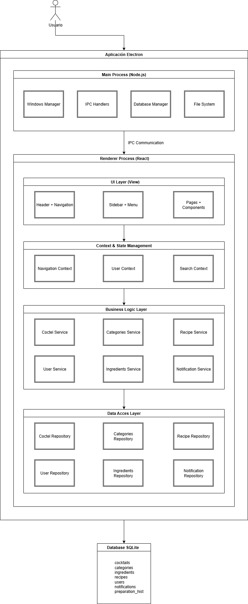
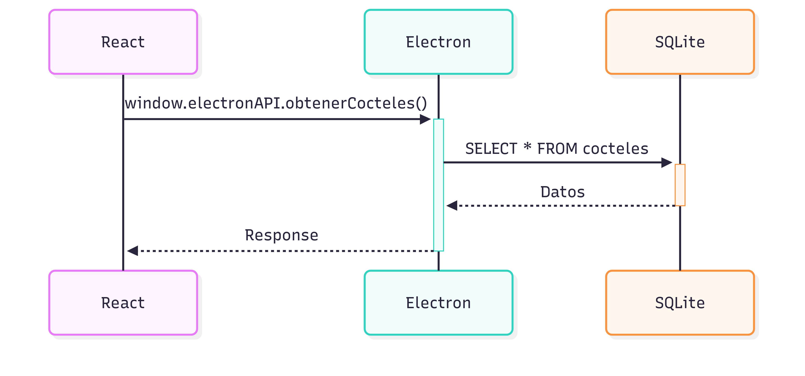

# 🏛️ Arquitectura Avanzada - ZFCocteles ✨

**Aplicación Electron profesional** con arquitectura por capas **monolítica**, patrón **Repository Superior**, base de datos **SQLite normalizada** y **React moderno**.

## 🎯 ARQUITECTURA ACTUAL

### 📊 Visión General del Sistema

<div align="center">
  
</div>

## 🏗️ CAPAS ARQUITECTURALES DETALLADAS

### 📊 1. CAPA DE DATOS

#### 🗄️ Base de Datos SQLite Normalizada

```sql
-- Esquema moderno con constraints y relaciones
CREATE TABLE cocktails (
  id INTEGER PRIMARY KEY AUTOINCREMENT,
  name TEXT NOT NULL,
  difficulty TEXT CHECK(difficulty IN ('fácil', 'difícil')) NOT NULL,
  preparation_time INTEGER NOT NULL,
  id_owner INTEGER REFERENCES users(id),
  UNIQUE(name, id_owner)
);

-- Sistema de categorías flexible
CREATE TABLE categories (
  id INTEGER PRIMARY KEY AUTOINCREMENT,
  name TEXT NOT NULL,
  type TEXT CHECK(type IN ('system', 'personal')) NOT NULL,
  color TEXT DEFAULT '#e2e8f0'
);

-- Relación muchos-a-muchos optimizada
CREATE TABLE cocktail_categories (
  cocktail_id INTEGER REFERENCES cocktails(id) ON DELETE CASCADE,
  category_id INTEGER REFERENCES categories(id) ON DELETE CASCADE,
  PRIMARY KEY(cocktail_id, category_id)
);
```

#### 🔧 Repository Pattern

```javascript
// BaseRepository - Patrón reutilizable
class BaseRepository {
  constructor(tableName, primaryKey = 'id') {
    this.tableName = tableName;
    this.primaryKey = primaryKey;
    this.db = getDatabase();
  }

  findAll() {
    /* SQL query with prepared statements */
  }
  findById(id) {
    /* Parameterized query */
  }
  create(data) {
    /* Insert with validation */
  }
  update(id, data) {
    /* Update with constraints */
  }
  delete(id) {
    /* Cascade delete handling */
  }
}

// Repositorios especializados heredan funcionalidad
class CocktailRepository extends BaseRepository {
  constructor() {
    super('cocktails', 'id');
  }

  // Métodos específicos del dominio
  findByUserId(userId) {
    /* Usuario-specific queries */
  }
  findFeatured() {
    /* Complex joins with categories */
  }
  searchByIngredients(ingredients) {
    /* Advanced filtering */
  }
}
```

### ⚡ 2. CAPA DE ESTADO Y CONTEXTO

#### 🎛️ Context Pattern con React

```javascript
// NavigationContext - Estado global de navegación
const NavigationContext = createContext();

export function NavigationProvider({ children }) {
  const [currentPage, setCurrentPage] = useState('catalog');
  const [sidebarOpen, setSidebarOpen] = useState(false);

  return (
    <NavigationContext.Provider
      value={{
        currentPage,
        setCurrentPage,
        sidebarOpen,
        setSidebarOpen,
      }}
    >
      {children}
    </NavigationContext.Provider>
  );
}
```

### 🧠 3. CAPA DE LÓGICA DE NEGOCIO

#### 🔄 Services y Hooks Personalizados

```javascript
// Hook personalizado para cócteles
export function useCocktails() {
  const [cocktails, setCocktails] = useState([]);
  const [loading, setLoading] = useState(false);

  const loadCocktails = useCallback(async () => {
    setLoading(true);
    try {
      const data = await window.electronAPI.getCocktails();
      setCocktails(data);
    } catch (error) {
      console.error('Error loading cocktails:', error);
    } finally {
      setLoading(false);
    }
  }, []);

  return { cocktails, loading, loadCocktails };
}
```

#### 🎯 Builder Pattern para Modelos

```javascript
// CocktailBuilder - Construcción fluida de objetos
class CocktailBuilder {
  constructor() {
    this.cocktail = {};
  }

  withName(name) {
    this.cocktail.name = name;
    return this;
  }

  withDifficulty(difficulty) {
    this.cocktail.difficulty = difficulty;
    return this;
  }

  withPreparationTime(time) {
    this.cocktail.preparation_time = time;
    return this;
  }

  build() {
    // Validación antes de crear
    if (!this.cocktail.name) throw new Error('Name is required');
    return this.cocktail;
  }
}

// Uso: new CocktailBuilder().withName('Mojito').withDifficulty('fácil').build()
```

### 🎨 4. CAPA DE PRESENTACIÓN

#### 🧩 Componentes Modulares

```
src/renderer/components/
├── common/           # Componentes reutilizables
│   ├── Button.jsx
│   ├── Input.jsx
│   └── Modal.jsx
├── cocteles/        # Componentes específicos de cócteles
│   ├── CocktailCard.jsx
│   ├── CocktailForm.jsx
│   └── CocktailList.jsx
├── layout/          # Componentes de estructura
│   ├── Header.jsx
│   ├── Sidebar.jsx
│   └── MainLayout.jsx
└── icons/           # Iconos SVG componentes
```

## 🔄 COMUNICACIÓN ENTRE PROCESOS (IPC) - SEGURA

### 🌉 Flujo de Datos Seguro

<div align="center">
  
</div>

### 🔒 API Segura Expuesta

```javascript
// preload.js - Bridge seguro
const { contextBridge, ipcRenderer } = require('electron');

contextBridge.exposeInMainWorld('electronAPI', {
  // Cócteles
  getCocktails: () => ipcRenderer.invoke('get-cocktails'),
  createCocktail: data => ipcRenderer.invoke('create-cocktail', data),
  updateCocktail: (id, data) => ipcRenderer.invoke('update-cocktail', id, data),

  // Categorías
  getCategories: () => ipcRenderer.invoke('get-categories'),
  addToCategory: (cocktailId, categoryId) =>
    ipcRenderer.invoke('add-to-category', cocktailId, categoryId),

  // Usuario
  getCurrentUser: () => ipcRenderer.invoke('get-current-user'),

  // Notificaciones
  showNotification: message => ipcRenderer.invoke('show-notification', message),
});
```

## 📚 PATRONES DE DISEÑO IMPLEMENTADOS

### 🏭 1. Repository Pattern

- **Propósito**: Abstrae acceso a datos
- **Beneficio**: Código desacoplado y testeable
- **Implementación**: `BaseRepository` + especializaciones

### 🏗️ 2. Builder Pattern

- **Propósito**: Construcción fluida de objetos complejos (crear cócteles, recetas, etc.)
- **Beneficio**: API intuitiva y validación centralizada
- **Implementación**: `CocktailBuilder`, `RecipeBuilder`
- **Ejemplo**:

```javascript
const mojito = new CoctelBuilder()
  .setName('Mojito Clásico')
  .setDifficulty('fácil')
  .setCategory('Refrescante')
  .addIngredient('Ron blanco', 60, 'ml')
  .addIngredient('Menta fresca', 10, 'hojas')
  .addIngredient('Azúcar', 2, 'cucharaditas')
  .addStep('Machacar suavemente la menta', 1, true)
  .addStep('Agregar ron y azúcar', 2, false)
  .setGlass('highball')
  .setPreparationTime(5)
  .build();
```

### 🔄 3. Singleton Pattern

- **Propósito**: Una instancia de conexión a BD
- **Beneficio**: Optimización de recursos
- **Implementación**: Database connection manager (`db/`)

### 📡 4. Observer Pattern

- **Propósito**: Reactividad en la UI
- **Beneficio**: Estado sincronizado automáticamente
- **Implementación**: React Context + useState

### 🎯 5. Strategy Pattern

- **Propósito**: Algoritmos intercambiables
- **Beneficio**: Flexibilidad en búsquedas y filtros
- **Implementación**: Search strategies, sort strategies

## 🚀 CARACTERÍSTICAS TÉCNICAS AVANZADAS

### ⚡ Performance

- **Prepared Statements** para todas las consultas SQL - Implementado ✅
  Mejora la seguridad y velocidad de las consultas.
- **Índices optimizados** en columnas de búsqueda frecuente (ej. `name`, `difficulty`) - Implementado ✅
  Mejora la velocidad de búsqueda y filtrado.
- **Lazy loading** de imágenes y componentes - No Implementado ❌, Prioridad media 🔧
  Carga diferida de recursos para mejorar el tiempo de carga inicial.
- **React.memo** para prevenir re-renders innecesarios - No Implementado ❌, Prioridad alta 🔥
  Optimiza el rendimiento de componentes pesados.

### 🔒 Seguridad

- **SQL Injection Prevention** con parámetros - Implementado ✅
  Uso de consultas parametrizadas para evitar inyecciones SQL.
- **Input Validation** en múltiples capas - Parcialmente Implementado 🔄
  Validación de datos en el frontend y backend.
  TODO: Implementar validación completa en todos los puntos de entrada (ej. formularios, API).
- **Secure IPC** con contextBridge - Implementado ✅
  Exposición segura de la API de Electron al renderer.
- **Data Sanitization** antes de almacenar - No Implementado ❌ - Prioridad alta 🔥
  Sanitización de datos de entrada para prevenir XSS y otros ataques.

### 🧪 Testabilidad

- **Repository Pattern** permite mocking fácil - Implementado ✅
  Facilita pruebas unitarias y de integración.
- **Dependency Injection** en servicios - No Implementado ❌ - Prioridad baja 📋
  Mejora la testabilidad al permitir inyectar dependencias.
- **Unit Tests** para lógica de negocio - No Implementado ❌ - Prioridad alta 🔥
  Pruebas unitarias para funciones y servicios críticos.
- **Integration Tests** para IPC - No Implementado ❌ - Prioridad alta 🔥
  Pruebas de integración para asegurar la comunicación entre procesos.

### 📦 Maintainabilidad

- **Separation of Concerns** clara entre capas - Implementado ✅
  Cada capa tiene responsabilidades bien definidas.
- **Single Responsibility** en cada clase/función - Implementado ✅
  Cada clase o función tiene una única responsabilidad.
- **Clean Code** con naming conventions - Implementado ✅
  Código legible y mantenible.
- **Documentation** inline y externa - Implementado ✅
  Comentarios claros y documentación técnica.

## 🎯 VENTAJAS DE ESTA ARQUITECTURA

### ✅ Para el Desarrollo

1. **Productividad**: Patrones claros y reutilizables
2. **Debugging**: Errores fáciles de localizar
3. **Testing**: Componentes aislados y testeables
4. **Colaboración**: Estructura comprensible para todo el equipo

### ✅ Para el Mantenimiento

1. **Escalabilidad**: Fácil agregar nuevas funcionalidades
2. **Refactoring**: Cambios sin romper dependencias
3. **Performance**: Optimizaciones localizadas
4. **Documentation**: Auto-documentada por la estructura

### ✅ Para la Calidad

1. **Robustez**: Múltiples capas de validación
2. **Consistencia**: Patrones uniformes en todo el código
3. **Seguridad**: Validación y sanitización sistemática
4. **Usabilidad**: Separación clara UI/Lógica

---

**Esta arquitectura representa el estado del arte en desarrollo Electron moderno, combinando las mejores prácticas de ingeniería de software con tecnologías cutting-edge.**

#### UI Layer (`components/`):

```
components/
├── layout/
│   ├── Header.jsx        → Top navigation bar
│   ├── Sidebar.jsx       → Main menu navigation
│   ├── MainContent.jsx   → Content wrapper
│   └── Footer.jsx        → Bottom bar
├── common/              → Reusable UI components
├── cocteles/           → Cocktail-specific components
└── icons/              → SVG icon components
```

#### Pages (`pages/`):

- **CatalogoPage.jsx** → Cocktail catalog & search
- **CategoriasPage.jsx** → Category management
- **CrearPage.jsx** → Create new cocktails
- **ManualPage.jsx** → User guides & tutorials
- **HistorialPage.jsx** → Preparation history
- **AjustesPage.jsx** → App settings
- **NotificacionesPage.jsx** → Notification center
- **UsuarioPage.jsx** → User profile & stats

#### State Management (`context/`):

- **NavigationContext.jsx** → Global navigation state

#### Business Logic (`services/`, `controllers/`, `hooks/`):

- Domain-specific logic and React state management

**🏗️ Arquitectura robusta, escalable y mantenible para la gestión completa de cócteles** 🍹✨
