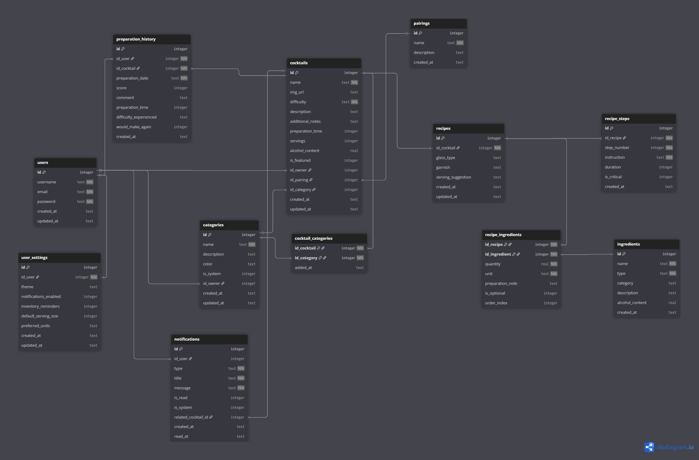

# 🗃️ Base de Datos (SQLite)

🏗️ Arquitectura robusta, escalable y mantenible para la gestión completa de cócteles 🍹.

## 📊 Diseño de Base de Datos

**🔗 Visualización Completa**: [Diagrama ER Interactivo](https://dbdiagram.io/d/ZFCoctelesDB-687156f3f413ba35087bc23a)

<details>
<summary>📈 <strong>Ver Diagrama ER Estático</strong> - Imagen PNG del esquema completo</summary>

> **Nota**: Para una experiencia interactiva completa, usa el enlace de arriba. Esta imagen muestra la estructura estática.

  <div align="center">
    
  </div>
</details>

## 🏗️ Arquitectura de Datos

### 📋 Entidades Principales (12 tablas)

| Entidad                   | Propósito                  | Características Clave                          |
| ------------------------- | -------------------------- | ---------------------------------------------- |
| **`users`**               | Gestión de usuarios        | Username único, configuraciones personales     |
| **`cocktails`**           | Catálogo principal         | Dificultad, tiempo prep., contenido alcohólico |
| **`categories`**          | Sistema de categorización  | Favoritos (sistema) + personalizadas           |
| **`ingredients`**         | Inventario de ingredientes | Tipo, categoría, % alcohol                     |
| **`recipes`**             | Recetas detalladas         | 1:1 con cócteles, pasos estructurados          |
| **`preparation_history`** | Historial analítico        | Métricas, calificaciones, tiempos reales       |

### 🔄 Relaciones Inteligentes

```sql
-- Relación N:M optimizada - Cócteles ↔ Categorías
cocktail_categories (cocktail_id, category_id, added_at)

-- Receta con ingredientes detallados
recipe_ingredients (recipe_id, ingredient_id, quantity, unit, preparation_note)

-- Pasos de preparación ordenados
recipe_steps (recipe_id, step_number, instruction, duration, is_critical)
```

## ✨ Características Avanzadas

### 🔒 Integridad de Datos

- **Constraints robustos**: `CHECK` constraints para validación (dificultad, scores 0-5)
- **Claves foráneas**: `ON DELETE CASCADE/SET NULL` para consistencia
- **Campos únicos**: Username, email, nombres de cócteles por usuario
- **Valores por defecto**: Timestamps automáticos, configuraciones sensatas

### ⚡ Optimización de Performance

```sql
-- Índices estratégicos para consultas frecuentes
CREATE INDEX idx_cocktails_difficulty ON cocktails(difficulty);
CREATE INDEX idx_cocktails_name ON cocktails(name);
CREATE INDEX idx_preparation_history_user ON preparation_history(id_user);
CREATE INDEX idx_notifications_user_unread ON notifications(id_user, is_read);
```

### 🎯 Sistema de Categorías

**Innovación clave**: Los **favoritos NO son una tabla separada**, sino una **categoría del sistema**:

```sql
-- Categorías flexibles con tipos
categories (id, name, is_system, color, id_owner)

-- Favoritos como categoría especial
INSERT INTO categories VALUES (..., 'Favoritos', 1, '#FCD34D', NULL);

-- Múltiples categorías por cóctel
cocktail_categories (id_cocktail, id_category, added_at)
```

**Ventajas del enfoque**:

- ✅ **Escalable**: Fácil agregar "Recientes", "Por Probar", etc.
- ✅ **Flexible**: Un cóctel puede estar en múltiples categorías
- ✅ **Consistente**: API uniforme para todas las categorizaciones

## 📊 Datos de Ejemplo Incluidos

El sistema incluye datos iniciales para desarrollo:

```javascript
// Seeders automáticos en primera ejecución
- 3 cócteles base (Mojito, Manhattan, Piña Colada)
- Categorías del sistema (Favoritos, Recientes, Por Probar)
- 12 ingredientes esenciales (rones, vodka, gin, etc.)
- 5 tipos de maridajes (aperitivo, digestivo, etc.)
```

## 🔧 Configuración y Rendimiento

### 🚀 Configuración SQLite Optimizada

```javascript
// database.js - Configuración profesional
db.pragma('journal_mode = WAL'); // Write-Ahead Logging
db.pragma('foreign_keys = ON'); // Integridad referencial
db.pragma('synchronous = NORMAL'); // Balance seguridad/velocidad
```

### 📁 Ubicación de de la Base Datos

```javascript
// Multiplataforma y usuario-específico
Windows: C:\Users\[user]\AppData\Roaming\zfcocteles\zfcocteles.db
macOS:   ~/Library/Application Support/zfcocteles/zfcocteles.db
Linux:   ~/.config/zfcocteles/zfcocteles.db
```

### 🧪 Testing y Desarrollo

```javascript
// Base de datos en memoria para tests
if (process.env.NODE_ENV === 'test') {
  return ':memory:';
}

// Esquema auto-aplicado con IF NOT EXISTS
// Sin errores en reinicios de desarrollo
```

### 🔄 Migración y Mantenimiento

- **Schema versionado**: Archivo `schema.sql` único como fuente de verdad
- **Migraciones seguras**: `IF NOT EXISTS` evita conflictos
- **Backup automático**: WAL mode facilita backup en caliente
- **Rollback support**: Transacciones para operaciones críticas

---

## 🎯 Para Desarrolladores

**Acceso a datos través de Repository Pattern**:

```javascript
// Ejemplo de uso típico
const cocktails = cocktailRepository.findByUserId(userId);
const favorites = favoriteRepository.findByUserId(userId);
const categories = categoryRepository.findSystemCategories();
```

**Consultas complejas simplificadas**:

```javascript
// Búsqueda con ingredientes
const results = cocktailRepository.searchByIngredients(['ron', 'menta']);

// Historial con métricas
const stats = historyRepository.getUserStats(userId);
```

**La base de datos está diseñada para soportar todas las funcionalidades actuales y futuras del proyecto con máximo rendimiento y flexibilidad.** 🚀
